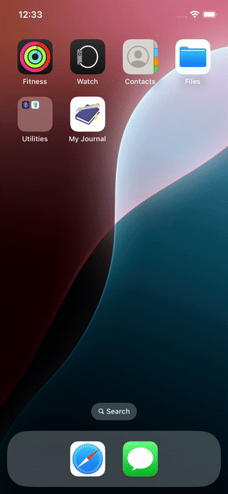

# 📓 iOS Journal App

A minimalistic iOS Journal app built with SwiftUI and Core Data.  
Effortlessly record your thoughts and view them anytime, with full support for Light and Dark Modes.

## 🎬 Preview Demo

---

## 🛠 Features

- 🏠 **Home Page**:  
  View a list of your journal entries stored in Core Data.

- ➕ **Add Entry Page**:  
  Create and save a new journal entry.

- 🌗 **Light & Dark Mode Support**:  
  The app automatically adapts to your device's appearance settings to provide an optimal reading experience.

## 🧱 Tech Stack

- **SwiftUI** – for building modern declarative UI.
- **Core Data** – for local data storage and persistence.
- **Appearance Adaptability** – Support for light and dark themes out of the box.

